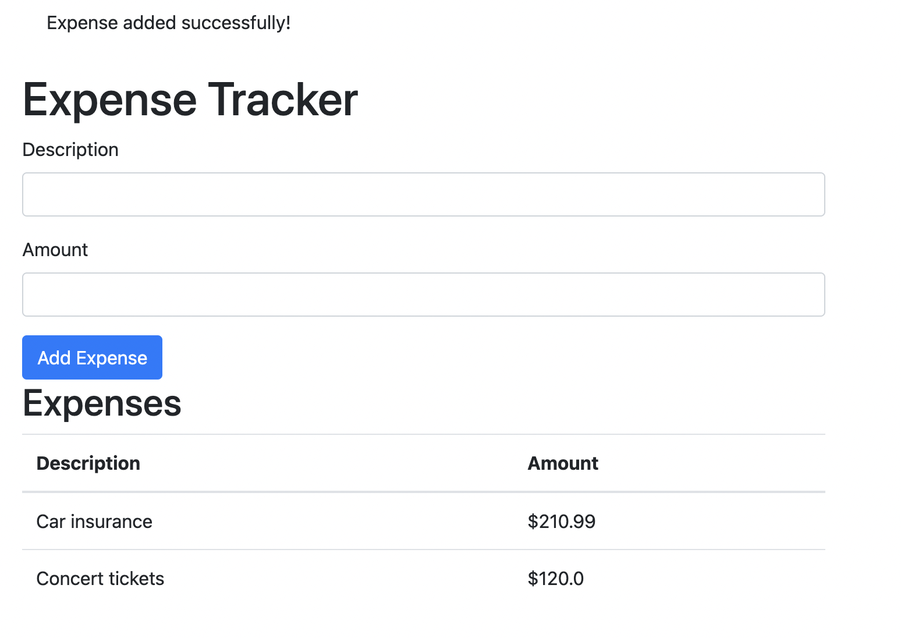

# Expense Tracker
 A Flask web application to track expenses.

<hr>
Home screen<br>

<hr>


## Initial Setup
<hr>

Clone repo and create a virtual environment
```
$ git clone https://github.com/giedriusstankauskas/expense-tracker.git
$ cd expense-tracker
$ python3 -m venv venv
$ . venv/bin/activate
```
Install dependencies
```
$ (venv) pip install -r requirements.txt
```

Start Flask app.
```
$ (venv) export FLASK_APP=app.py
$ (venv) flask run
```
